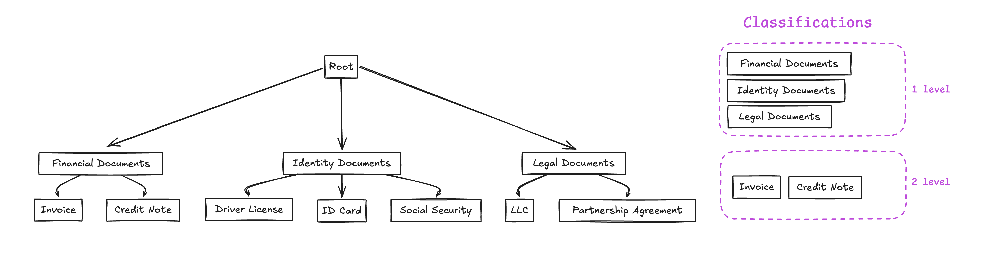

# Tree-Based Classification

<div align="center">
  
</div>

In document intelligence, challenges often arise when dealing with a large number of similar document types. Tree-based classification organizes classifications into a hierarchical structure, breaking down the task into smaller, more manageable batches.

## Basic Concept

Tree-based classification offers:
- **Increased Accuracy**: By narrowing down options at each step
- **Scalability**: Easy addition of new document types
- **Reduced Context**: Smaller context windows at each level

## Implementation

Here's how to implement a classification tree:

```python
from extract_thinker import Classification, ClassificationNode, ClassificationTree
from extract_thinker.models.contract import Contract

# Define contracts for each level
class FinancialContract(Contract):
    total_amount: int
    document_number: str
    document_date: str

class InvoiceContract(Contract):
    invoice_number: str
    invoice_date: str
    lines: List[LineItem]
    total_amount: float

class CreditNoteContract(Contract):
    credit_note_number: str
    credit_note_date: str
    lines: List[LineItem]
    total_amount: float

# Create the classification tree
financial_docs = ClassificationNode(
    classification=Classification(
        name="Financial Documents",
        description="This is a financial document",
        contract=FinancialContract,
    ),
    children=[
        ClassificationNode(
            classification=Classification(
                name="Invoice",
                description="This is an invoice",
                contract=InvoiceContract,
            )
        ),
        ClassificationNode(
            classification=Classification(
                name="Credit Note",
                description="This is a credit note",
                contract=CreditNoteContract,
            )
        )
    ]
)

# Create the tree
classification_tree = ClassificationTree(
    nodes=[financial_docs]
)

# Initialize process
process = Process()
process.add_classify_extractor([[extractor]])

# Classify using tree
result = process.classify(
    "document.pdf",
    classification_tree,
    threshold=0.95
)
```

## Level-Based Contracts

When implementing tree-based classification, consider contract complexity at each level:

- **First Level**: Use minimal fields for broad categorization
  ```python
  class FinancialContract(Contract):
      total_amount: int  # Just key identifying fields
  ```

- **Second Level**: Include full field set for precise classification
  ```python
  class InvoiceContract(Contract):
      invoice_number: str
      invoice_date: str
      lines: List[LineItem]  # Complete field set
      total_amount: float
  ```