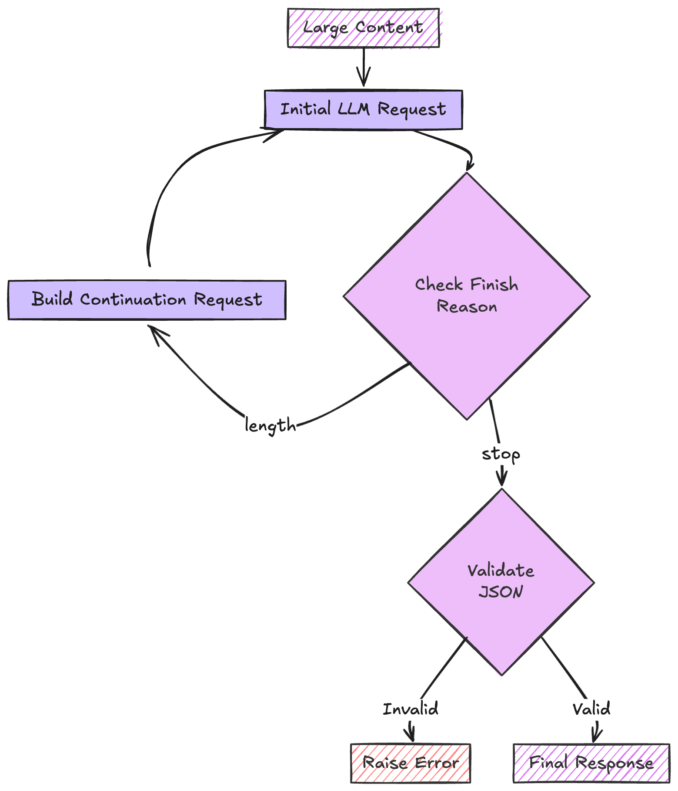

# Concatenate Strategy

The Concatenate strategy is designed to handle content that exceeds the LLM's context window by splitting it into manageable chunks, processing them separately, and then combining the results.

<div align="center">
  
</div>

## How It Works

**1. Initial Request**

- Sends the content to the LLM with the desired response structure
- Monitors the LLM's response completion status

**2. Continuation Process**

- If response is truncated (finish_reason="length"), builds a continuation request
- Includes previous partial response for context
- Continues until LLM indicates completion

**3. Validation**

- When LLM indicates completion (finish_reason="stop")
- Validates the combined JSON response
- Raises error if invalid JSON is received on completion

**4. Response Processing**

- Combines all response parts
- Validates against the specified response model
- Returns structured data

## Usage

```python
from extract_thinker import Extractor
from extract_thinker.models.completion_strategy import CompletionStrategy

extractor = Extractor()
extractor.load_llm("gpt-4o")

result = extractor.extract(
    file_path,
    ResponseModel,
    completion_strategy=CompletionStrategy.CONCATENATE
)
```

## Benefits

- **Handles Large Content**: Can process documents larger than the output context window
- **Maintains Context**: Attempts to keep related content together

## Implementation Details

??? example "Concatenation Handler Implementation"
    The ConcatenationHandler implements the CONCATENATE strategy:
    ```python
    --8<-- "extract_thinker/concatenation_handler.py"
    ```

## When to Use

CONCATENATE is the best choice when:

**Context window is large**

- For models like gpt-4o, claude-3-5-sonnet, etc.

**The content is not too large**

- Should be used for documents that are not too large (e.g. 500 pages)

For handling bigger documents, consider using the [PAGINATE strategy](../completion-strategies/paginate.md).