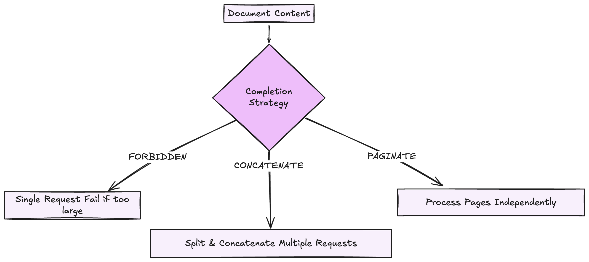

# Completion Strategies

ExtractThinker provides different strategies for handling document content processing through LLMs, especially when dealing with content that might exceed the model's context window. There are three main strategies: **Forbidden**, **Concatenate**, and **Paginate**.

<div align="center">
  
</div>

### FORBIDDEN Strategy

The FORBIDDEN strategy is the default approach - it prevents processing of content that exceeds the model's context window. This is the simplest strategy, while larger content can be handled using other available strategies.

```python
from extract_thinker import Extractor
from extract_thinker.models.completion_strategy import CompletionStrategy

extractor = Extractor()
extractor.load_llm("gpt-4o")

# Will raise ValueError if content is too large
result = extractor.extract(
    file_path,
    ResponseModel,
    completion_strategy=CompletionStrategy.FORBIDDEN # Default
)
```

For more advanced strategies that handle larger content, see:

- [CONCATENATE Strategy](concatenate.md) - For handling content larger than the context window
- [PAGINATE Strategy](paginate.md) - For processing multi-page documents in parallel

The choice of completion strategy depends on your specific use case:

**Use FORBIDDEN when:**

- Content is guaranteed to fit in context window
- You need the simplest possible processing and default behavior
- You want to ensure content is processed as a single unit

**Use [CONCATENATE](concatenate.md) when:**

- Content might exceed context window
- The size exceeds the output but not the input context window.
- You want automatic handling of large content

**Use [PAGINATE](paginate.md) when:**

- Processing multi-page documents
- The size exceeds the output but and the input context window.
- You need sophisticated conflict resolution between pages