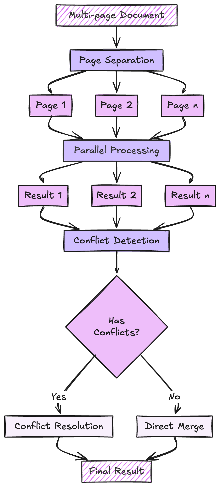

# PAGINATE Strategy

The PAGINATE strategy processes multi-page documents by handling each page independently and then intelligently merging the results, including sophisticated conflict resolution when pages contain overlapping information.

<div align="center">
  
</div>

## How It Works

**Page Separation**

- Identifies individual pages
- Preserves page metadata
- Maintains document structure

**Parallel Processing**

- Each page processed independently
- Uses full context window per page
- Handles page-specific content

**Result Collection**

- Gathers results from all pages
- Validates individual page results
- Prepares for merging

**Conflict Resolution**

- Detects overlapping information
- Resolves conflicts using confidence scores
- Maintains data consistency

## Usage

```python
from extract_thinker import Extractor
from extract_thinker.models.completion_strategy import CompletionStrategy

extractor = Extractor()
extractor.load_llm("gpt-4")

result = extractor.extract(
    file_path,
    ResponseModel,
    completion_strategy=CompletionStrategy.PAGINATE
)
```

## Benefits

- **Cheaper**: Reduced parallel context window would be cheaper than a long Concatenate Strategy
- **Parallel Processing**: Pages can be processed independently
- **Conflict Resolution**: Smart merging of results from different pages
- **Scalability**: Handles documents of any length
- **Accuracy**: Each page gets full context window attention

## Implementation Details

??? example "Pagination Handler Implementation"
    The PaginationHandler implements the PAGINATE strategy:
    ```python
    --8<-- "extract_thinker/pagination_handler.py"
    ```

## When to Use

PAGINATE is the best choice when:

**Context window is small**

- For local LLMs with smaller context windows (e.g Llama 3.3 8k context window).

**The content is too Big**

- When the file will not fit in the entire context window (e.g 500 page document)

**Model Accuracy**

- Sometimes LLMs can lose focus when the context is too big, Paginate strategy will solve this problem
