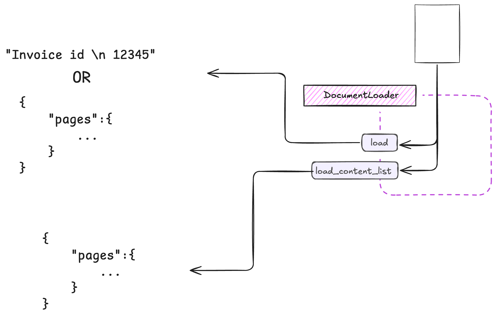

# Document Loaders

Document Loaders are the foundation of ExtractThinker's document processing pipeline. They handle the initial loading and preprocessing of documents, converting them into a standardized format that can be used by other components.

<div align="center">
  
</div>

## Basic Concept

A Document Loader can return content in two formats:
- A simple string containing the extracted text
- A structured object with pages and their content, that depends on the loader

??? example "Base Document Loader"
    The base DocumentLoader class defines the interface and common functionality that all loaders must implement:
    - `load_content_from_file`: Process files from disk
    - `load_content_from_stream`: Process BytesIO streams
    - `can_handle`: Validate file types
    - `convert_to_images`: Convert documents to images
    ```python
    --8<-- "extract_thinker/document_loader/document_loader.py"
    ```

## Core Features

### Configuration Support
All Document Loaders support configuration-based initialization through dedicated config classes:

```python
from extract_thinker import DocumentLoaderAWSTextract, TextractConfig

# Create configuration
config = TextractConfig(
    aws_access_key_id="your_key",
    feature_types=["TABLES", "FORMS"],
    cache_ttl=600
)

# Initialize with configuration
loader = DocumentLoaderAWSTextract(config)
```

### Caching
All Document Loaders include built-in caching capabilities through the `CachedDocumentLoader` base class. This provides automatic caching of document processing results with a configurable TTL:

??? example "Cached Document Loader"
    The CachedDocumentLoader extends the base loader with caching capabilities:
    ```python
    --8<-- "extract_thinker/document_loader/cached_document_loader.py"
    ```

Example usage of caching:
```python
from extract_thinker.document_loader import DocumentLoader

class MyCustomLoader(DocumentLoader):
    def __init__(self, content: Any = None, cache_ttl: int = 300):
        super().__init__(content, cache_ttl)  # 300 seconds default TTL
```

### File Type Support
Document Loaders automatically validate file types through the `can_handle` method:

```python
loader = MyCustomLoader()
if loader.can_handle("document.pdf"):
    content = loader.load("document.pdf")
```

### Multiple Input Types
Loaders support both file paths and BytesIO streams:

```python
# Load from file
content = loader.load("document.pdf")

# Load from stream
with open("document.pdf", "rb") as f:
    stream = BytesIO(f.read())
    content = loader.load(stream)
```

### Vision Mode Support
Many loaders support vision mode for handling images and visual content:

```python
# Enable vision mode
loader.set_vision_mode(True)

# Load document with images
pages = loader.load("document.pdf")
for page in pages:
    text = page["content"]
    image = page.get("image")  # Available in vision mode
```

### Image Conversion
The base loader includes utilities for converting documents to images:

```python
loader = DocumentLoader()
images = loader.convert_to_images(
    "document.pdf",
    scale=300/72  # DPI scaling
)
```

## Common Methods

All Document Loaders implement these core methods:

- `load(source)`: Main entry point for loading documents
- `load_content_from_file(file_path)`: Process files from disk
- `load_content_from_stream(stream)`: Process BytesIO streams
- `load_content_list(source)`: Load and split into pages
- `set_vision_mode(enabled)`: Enable/disable vision mode

## Best Practices

- Use configuration classes for complex initialization
- Set appropriate cache TTL based on your use case
- Check file type support before processing
- Consider memory usage when processing large files
- Enable vision mode only when needed
- Handle both file paths and streams for flexibility

## Available Loaders

ExtractThinker provides several specialized Document Loaders:

### Cloud Services
- [AWS Textract](aws-textract.md): AWS document processing with support for text, tables, forms, and layout analysis
- [Azure Form](azure-form.md): Azure's Document Intelligence with multiple model support
- [Google Document AI](google-document-ai.md): Google's document understanding with native PDF parsing

### Local Processing
- [PDF Plumber](pdf-plumber.md): Advanced PDF text and table extraction
- [PyPDF](pypdf.md): Basic PDF processing with password protection support
- [Tesseract](tesseract.md): Open-source OCR with multiple language support
- [Doc2txt](doc2txt.md): Microsoft Word document processing
- [Spreadsheet](spreadsheet.md): Excel and CSV handling
- [Text File](txt.md): Plain text file handling with encoding support
- [Markitdown](markitdown.md): Multi-format document processing
- [Docling](docling.md): Advanced document layout and table analysis

### Special Purpose
- [Web Loader](web-loader.md): Web page extraction with custom element handling
- [LLM Image](llm-image.md): Vision-enabled LLM processing

### Coming Soon
- `Adobe PDF Services` <span class="coming-soon">Coming Soon</span>: Adobe's PDF extraction and analysis
- `ABBYY FineReader` <span class="coming-soon">Coming Soon</span>: Enterprise-grade OCR solution
- `PaddleOCR` <span class="coming-soon">Coming Soon</span>: High-performance multilingual OCR
- `Unstructured` <span class="coming-soon">Coming Soon</span>: Open-source document preprocessing
- `Mathpix` <span class="coming-soon">Coming Soon</span>: Math and scientific document processing
- `EasyOCR` <span class="coming-soon">Coming Soon</span>: Ready-to-use OCR with multilingual support
- `Nanonets` <span class="coming-soon">Coming Soon</span>: API-based document processing
- `Mindee` <span class="coming-soon">Coming Soon</span>: Specialized document parsing APIs
- `Rossum` <span class="coming-soon">Coming Soon</span>: AI-powered document understanding
- `Kofax` <span class="coming-soon">Coming Soon</span>: Intelligent document processing

For more examples and advanced usage, check out the [examples directory](examples/) in the repository.
