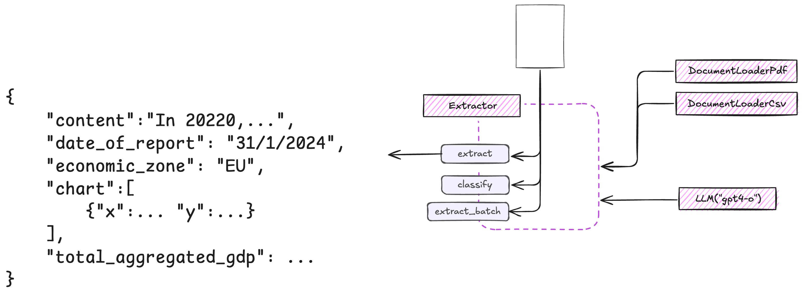

# Extractor

Extractor is the component that coordinates the extraction from documents. Contains a group of features for document processing like classify. Can be used alone or in group, inside of a Process.

<div align="center">
  
</div>

## Basic Extraction

The simplest way to extract data is using the `Extractor` class with a defined contract:

```python
from extract_thinker import Extractor, DocumentLoaderPyPdf, Contract

class InvoiceContract(Contract):
	invoice_number: str
	invoice_date: str
	total_amount: float

#Initialize the extractor
extractor = Extractor()
extractor.load_document_loader(DocumentLoaderPyPdf())
extractor.load_llm("gpt-4o-mini") # or any other supported model

#Extract data from your document
result = extractor.extract("invoice.pdf", InvoiceContract)

print(f"Invoice #{result.invoice_number}")
print(f"Date: {result.invoice_date}")
print(f"Total: ${result.total_amount}")
```

---

## Choosing the Right Model

When performing extraction, selecting the appropriate model is crucial for balancing performance, accuracy, and cost:

- **GPT-4o-mini**: Best for basic text extraction tasks, similar to OCR. Cost-effective for high-volume processing.
- **GPT-4o**: Ideal for tasks requiring deeper understanding of document structure and content.
- **o1 and o1-mini**: Perfect for complex extraction requiring reasoning and calculations.

## Advanced Extraction with Vision

For documents that contain images or require visual understanding, you can enable vision capabilities:

```python
from extract_thinker import Extractor, Contract
from typing import List

class ChartData(Contract):
	title: str
	data_points: List[float]
	description: str

#Initialize with vision support
extractor = Extractor()
extractor.load_llm("gpt-4o")

#Extract with vision enabled
result = extractor.extract(
	"chart.png",
	ChartData,
	vision=True # Enable vision processing
)
```

> **Note:** When using vision capabilities, ensure your documents are high quality images or PDFs for optimal results.

## Adding Context to Extraction

You can provide additional context to help guide the extraction process:

```python
from extract_thinker import Extractor, Contract
class ResumeContract(Contract):
	name: str
	skills: List[str]
	experience: List[dict]

#Add context about the job requirements
job_description = {
	"role": "Software Engineer",
	"required_skills": ["Python", "AWS", "Docker"]
}

result = extractor.extract(
	"resume.pdf",
	ResumeContract,
	content=job_description # Add extra context
)
```
