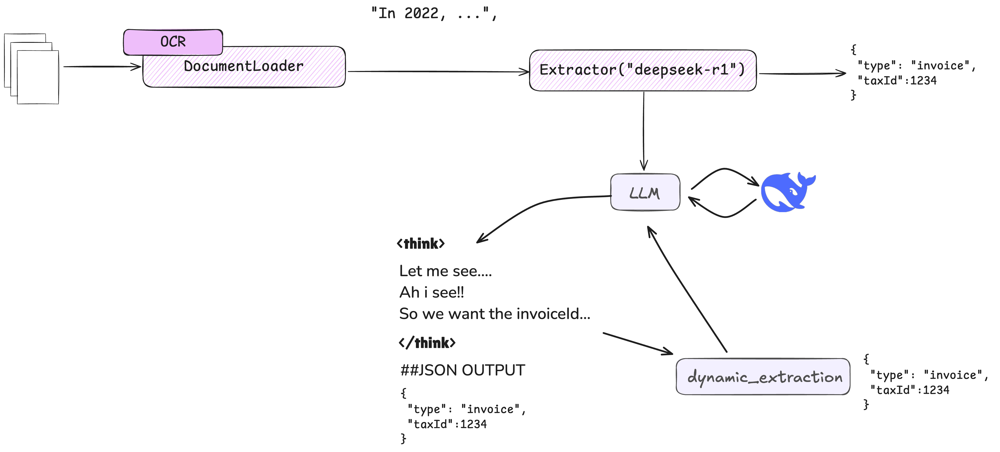

# Dynamic Parsing

!!! note "Recommendation"
    For most extraction tasks, we recommend using [Thinking Models](./thinking-models.md), which provide more comprehensive reasoning capabilities and broader provider support.

<div align="center">
  
</div>

Dynamic parsing enables flexible handling of structured outputs from LLM responses. This feature is particularly useful when reasoning models are used (e.g. DeepSeek R1).

## Overview

The dynamic parsing feature can be enabled using the `set_dynamic()` method on your LLM instance. When enabled, the LLM will:

1. Attempt to parse and validate JSON responses
2. Include structured thinking process in the output
3. Handle complex response models dynamically

## Usage

### Here's how to enable dynamic parsing:

```python
from extract_thinker import LLM

# Initialize LLM
llm = LLM("ollama/deepseek-r1:1.5b")

# Enable dynamic parsing
llm.set_dynamic(True)
```

### Uses this template structure:
```python
Please provide your thinking process within <think> tags, followed by your JSON output.

JSON structure:
{your_structure}

OUTPUT example:
<think>
Your step-by-step reasoning and analysis goes here...
</think>

##JSON OUTPUT
{
    ...
}
```

## Example: Invoice Extraction

Here's a complete example of using dynamic parsing for invoice extraction:

```python
from extract_thinker import LLM, Extractor
from extract_thinker.document_loader import DocumentLoaderPyPdf
from pydantic import BaseModel
from typing import List, Optional

# Define your invoice model
class InvoiceData(BaseModel):
    invoice_number: str
    date: str
    total_amount: float
    vendor_name: str
    line_items: List[dict]
    payment_terms: Optional[str]

# Initialize LLM with dynamic parsing
llm = LLM("ollama/deepseek-r1:1.5b")
llm.set_dynamic(True)  # Enable dynamic JSON parsing

# Setup document loader and extractor
document_loader = DocumentLoaderPyPdf()
extractor = Extractor(document_loader=document_loader, llm=llm)

# Extract information from invoice
result = extractor.extract("path/to/invoice.pdf", response_model=InvoiceData)
```