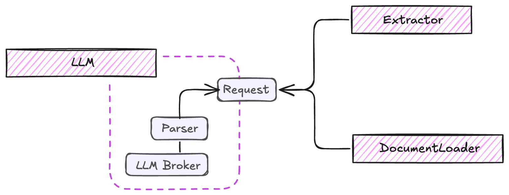

# LLM Integration

!!! warning "🚧 In Development"
    This component is currently under active development. The API might change in future releases.

The LLM component in ExtractThinker acts as a bridge between your document processing pipeline and various Language Model providers. It handles request formatting, response parsing, and provider-specific optimizations.

<div align="center">
  
</div>

The architecture consists of:

- **LLM Provider**: The actual language model service (OpenAI, Anthropic, etc.)
- **Request Handler**: Manages communication with the LLM provider

- **Parser**: Uses [instructor](https://github.com/jxnl/instructor) for structured outputs with Pydantic

- **LLM Broker**: Leverages [litellm](https://github.com/BerriAI/litellm) for unified model interface

## Basic Usage

```python
from extract_thinker import LLM

# Initialize with specific model
llm = LLM("gpt-4o")

# Or with custom provider and endpoint
llm = LLM(
    "claude-3-haiku-20240307",
    api_base="https://custom-endpoint"
)
```

??? example "Base LLM Implementation"
    ```python
    --8<-- "extract_thinker/llm.py"
    ```

For more examples and advanced usage, check out the [examples directory](examples/) in the repository.
