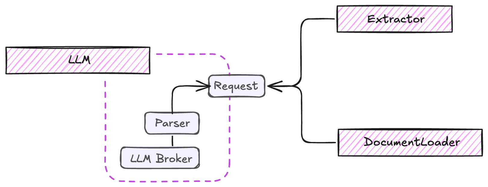

# LLM Integration

The LLM component in ExtractThinker acts as a bridge between your document processing pipeline and various Language Model providers. It handles request formatting, response parsing, and provider-specific optimizations.

<div align="center">
  
</div>

??? example "Base LLM Implementation"
    ```python
    --8<-- "extract_thinker/llm.py"
    ```

The architecture supports two different stacks:

**Default Stack**: Combines instructor and litellm

- Uses [instructor](https://python.useinstructor.com/) for structured outputs with Pydantic
- Leverages [litellm](https://docs.litellm.ai/docs/) for unified model interface

**Pydantic AI Stack** <span class="beta-badge">🧪 In Beta</span>

- All-in-one solution for Pydantic model integration
- Handles both model interfacing and structured outputs
- Built by the Pydantic team ([Learn more](https://ai.pydantic.dev/))

## Backend Options

```python
from extract_thinker import LLM
from extract_thinker.llm_engine import LLMEngine

# Initialize with default stack (instructor + litellm)
llm = LLM("gpt-4o")

# Or use Pydantic AI stack (Beta)
llm = LLM("openai:gpt-4o", backend=LLMEngine.PYDANTIC_AI)
```

ExtractThinker supports two LLM stacks:

### Default Stack (instructor + litellm)
The default stack combines instructor for structured outputs and litellm for model interfacing. It leverages [LiteLLM's unified API](https://docs.litellm.ai/docs/#litellm-python-sdk) for consistent model access:

```python
llm = LLM("gpt-4o", backend=LLMEngine.DEFAULT)
```

### Pydantic AI Stack (Beta)
An alternative all-in-one solution for model integration powered by [Pydantic AI](https://ai.pydantic.dev/):

```python
llm = LLM("openai:gpt-4o", backend=LLMEngine.PYDANTIC_AI)
```

!!! note "Pydantic AI Limitations"
    - Batch processing is not supported with the Pydantic AI backend
    - Router functionality is not available
    - Requires the `pydantic-ai` package to be installed
    
    [Read more about Pydantic AI features](https://ai.pydantic.dev/#why-use-pydanticai)