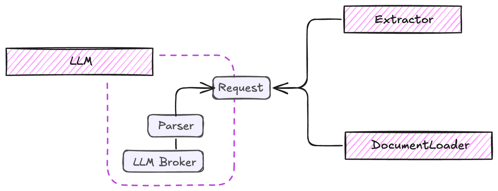

# LLM Integration

The LLM component in ExtractThinker acts as a bridge between your document processing pipeline and various Language Model providers. It handles request formatting, response parsing, and provider-specific optimizations.

<div align="center">
  
</div>

??? example "Base LLM Implementation"
    ```python
    --8<-- "extract_thinker/llm.py"
    ```

The architecture supports two different stacks:

**Default Stack**: Combines instructor and litellm

- Uses [instructor](https://python.useinstructor.com/) for structured outputs with Pydantic
- Leverages [litellm](https://docs.litellm.ai/docs/) for unified model interface

**Pydantic AI Stack** <span class="beta-badge">🧪 In Beta</span>

- All-in-one solution for Pydantic model integration
- Handles both model interfacing and structured outputs
- Built by the Pydantic team ([Learn more](https://ai.pydantic.dev/))

## Backend Options

```python
from extract_thinker import LLM
from extract_thinker.llm_engine import LLMEngine

# Initialize with default stack (instructor + litellm)
llm = LLM("gpt-4o")

# Or use Pydantic AI stack (Beta)
llm = LLM("openai:gpt-4o", backend=LLMEngine.PYDANTIC_AI)
```

ExtractThinker supports two LLM stacks:

### Default Stack (instructor + litellm)
The default stack combines instructor for structured outputs and litellm for model interfacing. It leverages [LiteLLM's unified API](https://docs.litellm.ai/docs/#litellm-python-sdk) for consistent model access:

```python
llm = LLM("gpt-4o", backend=LLMEngine.DEFAULT)
```

### Pydantic AI Stack (Beta)
An alternative all-in-one solution for model integration powered by [Pydantic AI](https://ai.pydantic.dev/):

```python
llm = LLM("openai:gpt-4o", backend=LLMEngine.PYDANTIC_AI)
```

!!! note "Pydantic AI Limitations"
    - Batch processing is not supported with the Pydantic AI backend
    - Router functionality is not available
    - Requires the `pydantic-ai` package to be installed
    
    [Read more about Pydantic AI features](https://ai.pydantic.dev/#why-use-pydanticai)

## Features

### Thinking Models

ExtractThinker's LLM integration includes support for "thinking models" that expose their reasoning process:

```python
from extract_thinker import LLM

# Initialize LLM
llm = LLM("gpt-4o")

# Enable thinking mode
llm.set_thinking(True)  # Automatically sets temperature to 1.0
```

Learn more about [Thinking Models](./thinking-models.md) and how they improve extraction results.

### Router Support

ExtractThinker supports LiteLLM's router functionality for model fallbacks:

```python
from extract_thinker import LLM
from litellm import Router

# Initialize router with fallbacks
router = Router(
    model_list=[
        {"model_name": "gpt-4o", "litellm_params": {"model": "gpt-4o"}},
        {"model_name": "claude-3-opus-20240229", "litellm_params": {"model": "claude-3-opus-20240229"}},
    ],
    fallbacks=[
        {"gpt-4o": "claude-3-opus-20240229"}
    ]
)

# Initialize LLM with router
llm = LLM("gpt-4o")
llm.load_router(router)
```

This enables seamless fallbacks between different providers if a request fails.
## Output limits and provider options

`token_limit` overrides the default completion budget (8,000 output tokens).
It also bounds the page-based reasoning estimate. It does **not** enlarge a
model's input context window; choose a compatible output budget and use
pagination for input documents that exceed the provider's context limit.

```python
from extract_thinker import LLM

llm = LLM(
    "your-provider/your-model",
    token_limit=4000,
    completion_kwargs={"logprobs": True, "top_logprobs": 3},
)
```

`completion_kwargs` forwards provider options through the default LiteLLM backend
for structured, routed and raw calls. Support for these options depends on the
selected provider/model. The mapping cannot replace the model, messages,
response schema, streaming mode or token budget; use the corresponding public
configuration instead.

After a direct structured request, `llm.last_completion` exposes the provider
response attached by Instructor, if available. Raw completion also stores its
provider response there. For providers exposing log probabilities, inspect
`llm.last_completion.choices[0].logprobs`. This metadata is optional, describes
the latest call, and should not be used to associate results across concurrent
calls on the same LLM instance. Extraction still returns the validated contract.
