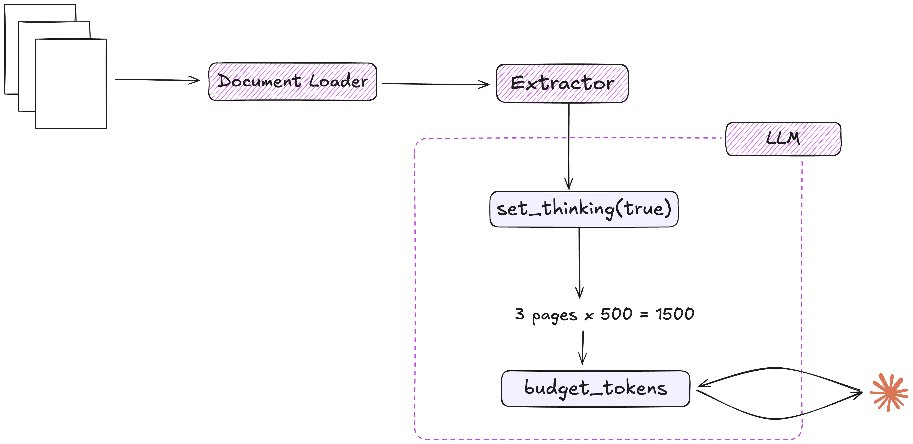

# Thinking Models

Thinking models enable LLMs to expose their reasoning process when generating structured outputs. This feature is particularly valuable for complex extraction tasks and document understanding.

## Overview

The thinking feature can be enabled using the `set_thinking()` method on your LLM instance. When enabled, the LLM will:

1. Expose its step-by-step reasoning process within `<think>` tags
2. Adjust token allocation to balance between reasoning and final output
3. Automatically set optimal temperature (1.0) for creative reasoning
4. Calculate appropriate thinking budgets based on document size

## Provider Support

ExtractThinker supports thinking models across various providers:

### OpenAI 

OpenAI models support explicit thinking via the liteLLM integration. When enabled, the temperature is automatically set to 1.0 to encourage creative reasoning:

```python
from extract_thinker import LLM

# Initialize LLM
llm = LLM("o3-mini")

# Enable thinking
llm.set_thinking(True)  # Automatically sets temperature to 1.0
```

### Claude 

<div align="center">
  
</div>


Claude models have native support for thinking processes:

```python
from extract_thinker import LLM

# Initialize LLM
llm = LLM("claude-3-7-sonnet-20250219")

# Enable thinking
llm.set_thinking(True)
```

#### Automatic Budget Allocation

A key advantage of thinking models is their automatic budget allocation for complex documents. When you enable thinking with `set_thinking(True)`, ExtractThinker automatically manages token allocation:

```python
from extract_thinker import LLM, Extractor
from extract_thinker.document_loader import DocumentLoaderPyPdf

# Initialize components
llm = LLM("gpt-4o")
document_loader = DocumentLoaderPyPdf()
extractor = Extractor(document_loader=document_loader, llm=llm)

# Enable thinking with automatic budget management
llm.set_thinking(True)

# Extract information
result = extractor.extract("path/to/document.pdf")
```

The budget calculation is done automatically based on document size:
- Each page is estimated at `DEFAULT_PAGE_TOKENS` (1,500 tokens)
- Thinking budget is set to `DEFAULT_THINKING_RATIO` (1/3) of content tokens
- Budgets are capped between `MIN_THINKING_BUDGET` (1,200) and `MAX_THINKING_BUDGET` (64,000)
- Total token limits respect the model's `MAX_TOKEN_LIMIT`

### DeepSeek 

<div align="center">
  
</div>

Reasoning-focused models like DeepSeek R1 work exceptionally well with thinking enabled:

```python
from extract_thinker import LLM

# Initialize LLM
llm = LLM("ollama/deepseek-r1:1.5b")

# Enable thinking
llm.set_thinking(True)
```

#### Thinking Output Format

When thinking is enabled, the LLM output includes a reasoning section within `<think>` tags:

```
<think>
Let me analyze this invoice...
I can see the invoice number at the top right: INV-2023-0042
The date appears to be January 15, 2024
The total amount is $1,234.56
</think>

##JSON OUTPUT
{
  "invoice_number": "INV-2023-0042",
  "date": "2024-01-15",
  "total_amount": 1234.56
}
``` 