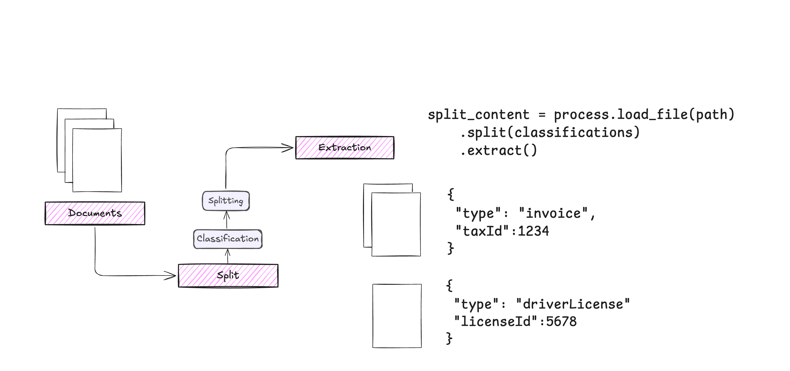

# Process

Process is a component that orchestrates the document processing workflow, allowing you to combine multiple DocumentLoaders and Extractors for complex document processing tasks.

<div align="center">
  
</div>

The workflow consists of:
```python
split_content = process.load_file(path)\
    .split(classifications)\
    .extract()
```

This creates a pipeline that:

1. Loads the document

2. Splits it into logical sections

3. Extracts structured data from each section

## Using Multiple DocumentLoaders

You can configure different DocumentLoaders for specific file types:

```python
from extract_thinker import Process
from extract_thinker.document_loader import (
    DocumentLoaderTesseract,
    DocumentLoaderPyPdf,
    DocumentLoaderAzureForm
)

process = Process()

# Set loaders for specific file types
process.set_document_loader_for_file_type(
    "pdf", DocumentLoaderPyPdf()
)
process.set_document_loader_for_file_type(
    "png", DocumentLoaderTesseract(tesseract_path)
)

# Or set a default loader
process.load_document_loader(
    DocumentLoaderAzureForm(subscription_key, endpoint)
)
```

## Using Multiple Extractors

You can use multiple extractors for different document types or processing stages:

```python
from extract_thinker import Extractor, Classification

# Initialize extractors with different models
gpt4_extractor = Extractor(document_loader)
gpt4_extractor.load_llm("gpt-4o")

claude_extractor = Extractor(document_loader)
claude_extractor.load_llm("claude-3-haiku-20240307")

# Create classifications with specific extractors
classifications = [
    Classification(
        name="Invoice",
        description="This is an invoice",
        contract=InvoiceContract,
        extractor=gpt4_extractor
    ),
    Classification(
        name="License",
        description="This is a license",
        contract=LicenseContract,
        extractor=claude_extractor
    )
]

# Process will use the appropriate extractor for each document type
result = process.load_file("document.pdf")\
    .split(classifications)\
    .extract()
```

For more examples and advanced usage, check out the [examples directory](examples/) in the repository.