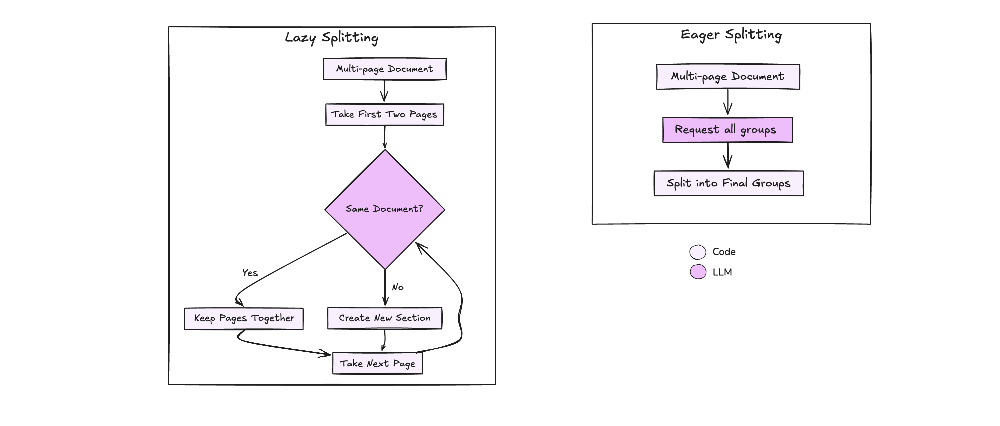

# Splitters

In document processing, splitting enables the separation of individual documents or sections within a combined file. This task is especially crucial when handling batches of documents where different parts may need distinct processing, and always with Sonnet. This can be done with two strategies: Eager and Lazy.

<div align="center">
  
</div>

### Page-Level Processing

Splitters work at the page level, determining which pages belong together as a single document. For example:

- A 10-page PDF might contain three separate invoices

- A scanned document might contain multiple forms

- A batch of documents might need to be separated by document type

The challenge is determining where one document ends and another begins, which is where our splitting strategies come in.

## Eager vs. Lazy Approaches

Eager and Lazy splitting have distinct use cases based on document size and the complexity of relationships between pages.

### Eager Splitting

Eager splitting processes all pages in a single pass, identifying and dividing all sections at once. It's efficient for small to medium-sized documents where context size does not limit performance.

```python
from extract_thinker import Splitter, SplittingStrategy

splitter = Splitter()
result = splitter.split(
    document,
    strategy=SplittingStrategy.EAGER
)
```

Benefits of Eager Splitting:
- **Speed**: Faster processing since all split points are determined upfront
- **Simplicity**: Ideal for documents that fit entirely within the model's context window
- **Consistency**: Better for documents where relationships between pages are important

### Lazy Splitting

Lazy splitting processes pages incrementally in chunks, assessing smaller groups of pages at a time to decide if they belong together. In this use case, groups of two pages are processed and checked for continuity, allowing it to scale efficiently for larger documents.

```python
result = splitter.split(
    document,
    strategy=SplittingStrategy.LAZY
)
```

Benefits of Lazy Splitting:
- **Scalability**: Well-suited for documents that exceed the model's context window
- **Memory Efficiency**: Processes only what's needed when needed
- **Flexibility**: Better for streaming or real-time processing

??? example "Base Splitter Implementation"
    The base Splitter class provides both eager and lazy implementations:
    ```python
    --8<-- "extract_thinker/splitter.py"
    ```

## Available Splitters

ExtractThinker provides two main splitter implementations:

- [Text Splitter](text.md): For text-based document splitting
- [Image Splitter](image.md): For image-based document splitting

## Recommended Approach

For most IDP use cases, Eager Splitting is appropriate since it offers:
- Simpler implementation
- Better handling of page relationships
- Faster processing for typical document sizes (under 50 pages)

However, consider Lazy Splitting when:
- Processing very large documents (50+ pages)
- Working with limited memory
- Handling streaming document inputs

## Best Practices

- Choose strategy based on document size and page count
- Consider context window limitations of your LLM

For more examples and advanced usage, check out the [examples directory](examples/) in the repository. 