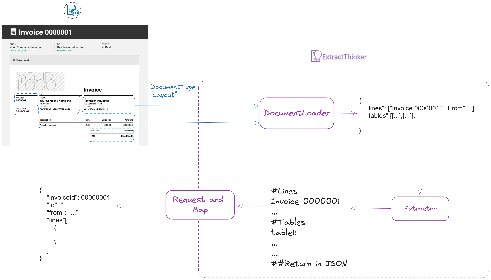

# Azure Document Intelligence Example

This guide demonstrates how to use Azure Document Intelligence with Phi-3 models for efficient document processing.

<div align="center">
  
</div>

## Basic Setup

Here's a complete example using Azure Document Intelligence with Phi-3:

```python
from extract_thinker import Extractor, Contract, LLM, DocumentLoaderAzureForm
from typing import List
from pydantic import Field

class InvoiceContract(Contract):
    invoice_number: str = Field("Invoice number")
    invoice_date: str = Field("Invoice date")
    total_amount: float = Field("Total amount")
    lines: List[LineItem] = Field("List of line items")

# Initialize Azure Document Intelligence
subscription_key = os.getenv("AZURE_SUBSCRIPTION_KEY")
endpoint = os.getenv("AZURE_ENDPOINT")
api_key = os.getenv("AZURE_AI_API_KEY")

extractor = Extractor()
extractor.load_document_loader(
    DocumentLoaderAzureForm(subscription_key, endpoint)
)

# Configure Phi-3 mini model
llm = LLM(
    model="azure/Phi-3-mini-128k-instruct",
    api_base="https://your-endpoint.inference.ai.azure.com",
    api_key=api_key,
    api_version="v1"
)

extractor.load_llm(llm)

# Process document
result = extractor.extract("invoice.pdf", InvoiceContract)
```

## High-Availability Setup

For production environments, configure multiple models with fallbacks:

```python
def config_azure_router():
    model_list = [
        {
            "model_name": "azure/Phi-3-mini-4k-instruct",
            "litellm_params": {
                "model": "azure/Phi-3-mini-4k-instruct",
                "api_base": os.getenv("AZURE_API_BASE"),
                "api_key": os.getenv("AZURE_API_KEY")
            },
        },
        {
            "model_name": "azure/Phi-3-mini-128k-instruct",
            "litellm_params": {
                "model": "azure/Phi-3-mini-128k-instruct",
                "api_base": os.getenv("AZURE_API_BASE"),
                "api_key": os.getenv("AZURE_API_KEY")
            }
        },
    ]

    return Router(
        model_list=model_list,
        default_fallbacks=["azure/Phi-3-mini-128k-instruct"],
        context_window_fallbacks=[
            {"azure/Phi-3-mini-4k-instruct": ["azure/Phi-3-mini-128k-instruct"]},
        ],
        set_verbose=True
    )
```

## Cost Optimization

Azure Document Intelligence offers different pricing tiers:

- **Read**: Basic OCR functionality ($0.05 per page)
- **Prebuilt Layout**: Structure detection ($0.05 per page)
- **Custom Layout**: Trained models (Higher cost)

Combined with Phi-3 models:
- Mini model: $0.25 per 1M tokens
- Medium model: $0.50 per 1M tokens

## Best Practices

1. **Document Type Selection**
   - Use "prebuilt-layout" for structured documents
   - Use "read" for basic text extraction
   - Consider custom layout only for specific needs

2. **Model Selection**
   - Use Phi-3 mini for basic extraction
   - Use Phi-3 medium for complex documents
   - Configure fallbacks for reliability

3. **Performance Optimization**
   - Batch process documents when possible
   - Use appropriate OCR level
   - Cache results for repeated processing 