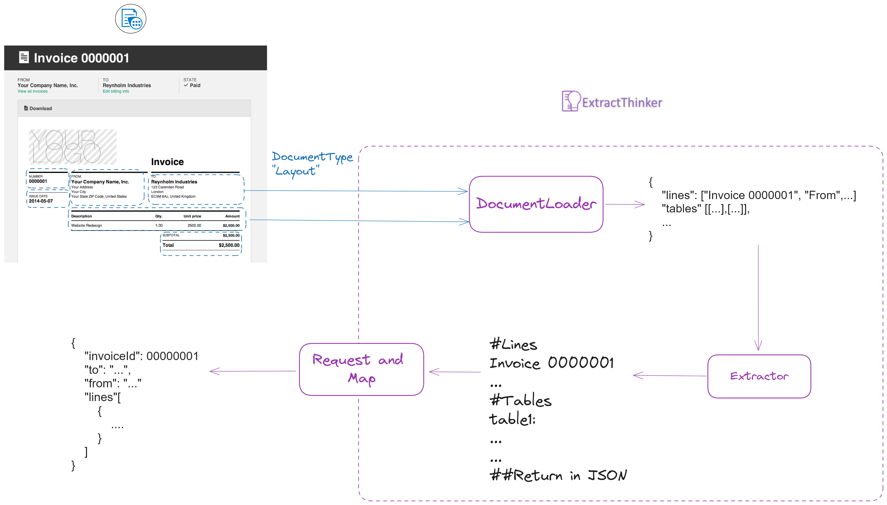

# Azure Document Intelligence Example

This guide demonstrates how to use Azure Document Intelligence with Phi-3 models for efficient document processing.

<div align="center">
  
</div>

## Basic Setup

Here's a complete example using Azure Document Intelligence with Phi-3:

```python
from extract_thinker import Extractor, Contract, LLM, DocumentLoaderAzureForm
from typing import List
from pydantic import Field

class InvoiceContract(Contract):
    invoice_number: str = Field("Invoice number")
    invoice_date: str = Field("Invoice date")
    total_amount: float = Field("Total amount")
    lines: List[LineItem] = Field("List of line items")

# Initialize Azure Document Intelligence
subscription_key = os.getenv("AZURE_SUBSCRIPTION_KEY")
endpoint = os.getenv("AZURE_ENDPOINT")
api_key = os.getenv("AZURE_AI_API_KEY")

extractor = Extractor()
extractor.load_document_loader(
    DocumentLoaderAzureForm(subscription_key, endpoint)
)

# Configure environment variables for Azure
import os
os.environ["AZURE_API_KEY"] = api_key
os.environ["AZURE_API_BASE"] = "https://your-endpoint.inference.ai.azure.com"
os.environ["AZURE_API_VERSION"] = "v1"

# Configure Phi-3 mini model
extractor.load_llm("azure/Phi-3-mini-128k-instruct")

# Process document
result = extractor.extract("invoice.pdf", InvoiceContract)
```

## Cost Optimization

Azure Document Intelligence offers different pricing tiers:

- **Read**: Basic OCR functionality ($0.001 per page)
- **Prebuilt Layout**: Structure detection ($0.01 per page)
- **Custom Layout**: Higher cost (discouraged)

## Best Practices

**Document Type Selection**

- Use "prebuilt-layout" when vision is not available
- Use "read" for most of the documents
- Consider custom layout only for specific needs, like signatures