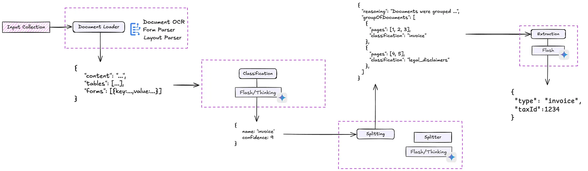

# Google Document AI Example

This guide shows how to use Google Document AI for advanced document processing with ExtractThinker, including integration with Gemini models for enhanced extraction capabilities.

<div align="center">
  
</div>

## Overview

Google Document AI is a powerful solution that provides:

- OCR and structural parsing
- Classification capabilities
- Specialized domain extractors (invoices, W2 forms, bank statements, etc.)
- Layout parsing and form processing

## Basic Setup

First, install the required dependencies:

```bash
pip install extract-thinker google-cloud-documentai
```

Here's how to use Google Document AI with ExtractThinker:

```python
from extract_thinker import Extractor, Contract
from extract_thinker.document_loader import DocumentLoaderGoogleDocumentAI
from typing import List
from pydantic import Field

class InvoiceLineItem(Contract):
    description: str = Field(description="Description of the item")
    quantity: int = Field(description="Quantity of items purchased")
    unit_price: float = Field(description="Price per unit")
    amount: float = Field(description="Total amount for this line")

class InvoiceContract(Contract):
    invoice_number: str = Field(description="Unique invoice identifier")
    invoice_date: str = Field(description="Date of the invoice")
    total_amount: float = Field(description="Overall total amount")
    line_items: List[InvoiceLineItem] = Field(description="List of items in this invoice")

# Initialize Google Document AI
extractor = Extractor()
extractor.load_document_loader(
    DocumentLoaderGoogleDocumentAI(
        project_id=os.getenv("DOCUMENTAI_PROJECT_ID"),
        location=os.getenv("DOCUMENTAI_LOCATION"),  # 'us' or 'eu'
        processor_id=os.getenv("DOCUMENTAI_PROCESSOR_ID"),
        credentials=os.getenv("DOCUMENTAI_GOOGLE_CREDENTIALS")
    )
)

# Configure Gemini model (recommended for enhanced extraction)
extractor.load_llm("vertex_ai/gemini-2.0-flash-exp")

# Process document
result = extractor.extract(
    source="invoice.pdf",
    response_model=InvoiceContract,
    vision=True  # Enable vision mode for better results with Gemini
)
```

## Document Splitting

ExtractThinker provides powerful document splitting capabilities that can be used with Google Document AI. Here's how to implement document splitting:

```python
from extract_thinker.process import Process
from extract_thinker.splitter import SplittingStrategy
from extract_thinker.image_splitter import ImageSplitter

# Create a Process instance
process = Process()

# Configure the splitter with Gemini model
image_splitter = ImageSplitter(model="vertex_ai/gemini-2.0-flash-exp")
process.load_splitter(image_splitter)

# Define your classifications (e.g., Invoice, Driver License)
my_classifications = [invoice_class, driver_license_class]

# Process a combined document with EAGER strategy
BULK_DOC_PATH = "path/to/combined_documents.pdf"

result = (process.load_file(BULK_DOC_PATH)
    .split(my_classifications, strategy=SplittingStrategy.EAGER)
    .extract(vision=True))

# Process results
for doc_content in result:
    print(f"Document Type: {type(doc_content).__name__}")
    print(doc_content.json(indent=2))
```

More information about document splitting can be found in the [document splitting](../core-concepts/splitters/index.md) section.

**Document OCR**: Basic text extraction and layout analysis

- Best paired with vision-enabled models like Gemini
- Most cost-effective for basic OCR needs

**Layout Parser**: Advanced structural analysis

- Use when vision capabilities aren't available
- Provides detailed document structure information

**Specialized Processors**: Domain-specific extraction

- Invoice Parser
- Form Parser
- US Driver License Parser
- And more...

## Cost Optimization

### Document AI Pricing (as of 2024)

**Document OCR**: $1.50 per 1,000 pages

- Volume discounts after 5M pages/month
- Most cost-effective for basic OCR needs

**Layout Parser**: $10 per 1,000 pages

- Good for structural analysis without vision models

**Form Parser and Custom Extractors**: $30 per 1,000 pages

- Volume discounts after 1M pages/month
- Best for complex form processing

**Specialized Processors**: Varies by type

- Example: Invoice parsing at $0.10 per 10 pages
- Includes pre-trained field extraction

### Cost-Effective Strategies

**Basic OCR + Gemini**:

- Use Document OCR ($0.0015/page)
- Combine with Gemini 2.0 Flash (~$0.0002/page)
- Total: ~$0.0017/page

**Layout Parser + LLM**:

- Use Layout Parser ($0.01/page)
- Add LLM processing (~$0.0002/page)
- Total: ~$0.0102/page

**Pure LLM Approach**:

- Use Gemini's vision capabilities directly
- Cost: ~$0.0002/page
- Note: May have lower accuracy for complex documents

## Supported Formats

- `PDF` (up to 2000 pages or 20MB)
- Images: `JPEG`, `PNG`, `TIFF`, `GIF`
- Office formats: `DOCX`, `XLSX`, `PPTX`
- Web: `HTML`

For more examples and implementation details, check out the [ExtractThinker repository](https://github.com/ExtractThinker/ExtractThinker) or the related article on [Medium](https://medium.com/towards-artificial-intelligence/extract-any-document-with-gemini-2-0-document-intelligence-with-extractthinker-4eda6eed99e5).