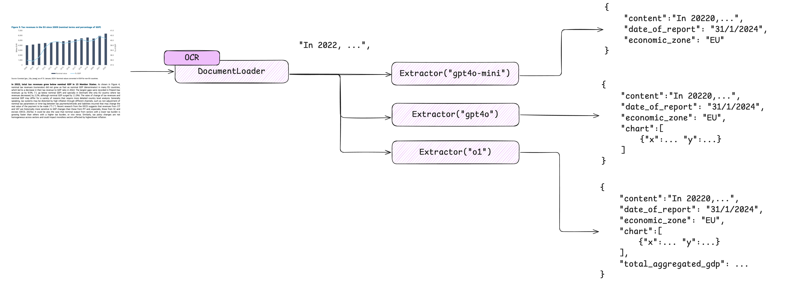

# Image and Chart Processing

ExtractThinker can process images and extract data from charts using vision-enabled models. This guide demonstrates how to use these features with practical examples.

<div align="center">
  
</div>

## Chart Data Extraction Example

Here's how to extract data from charts using the `ChartWithContent` contract:

```python
from extract_thinker import Extractor
from typing import List, Literal

class XYCoordinate:
    x: float
    y: float

class Chart:
    classification: Literal['line', 'bar', 'pie']
    coordinates: List[XYCoordinate]
    description: str

class ChartWithContent:
    content: str  # Text content from the page
    chart: Chart  # Extracted chart data

# Initialize extractor with vision capabilities
extractor = Extractor()
extractor.load_llm("gpt-4o")  # Required for vision tasks

# Extract chart data
result = extractor.extract(
    "chart.png",
    ChartWithContent,
    vision=True
)

# Access the extracted data
print(f"Chart type: {result.chart.classification}")
print(f"Description: {result.chart.description}")
```

## Invoice Processing with Vision Example

For documents containing images that require visual understanding, you can use vision processing with any contract. Here's an example using an invoice contract:

```python
from extract_thinker import Extractor
from typing import List

class LineItem:
    description: str
    quantity: int
    unit_price: float
    amount: float

class InvoiceContract:
    invoice_number: str
    invoice_date: str
    lines: List[LineItem]

# Initialize with vision support
extractor = Extractor()
extractor.load_llm("gpt-4o")

# Extract with vision enabled
result = extractor.extract(
    "invoice.pdf",
    InvoiceContract,
    vision=True
)

# Access extracted data
print(f"Invoice #: {result.invoice_number}")
print(f"Date: {result.invoice_date}")
for line in result.lines:
    print(f"Item: {line.description}, Quantity: {line.quantity}, Price: ${line.unit_price}")
```

## Resume/CV Processing Example

ExtractThinker can also process resumes and job descriptions, comparing requirements against candidate qualifications. Here's an example:

```python
from extract_thinker import Extractor, Contract, DocumentLoaderPyPdf
from typing import List, Optional
from pydantic import Field

# Define the job role contract
class RoleContract(Contract):
    company_name: str = Field("Company name")
    years_of_experience: int = Field("Years of experience required")
    is_remote: bool = Field("Is the role remote?")
    country: str = Field("Country of the role")
    city: Optional[str] = Field("City of the role")
    list_of_skills: List[str] = Field("""
        list of strings, e.g ["5 years experience", "3 years in React", "Typescript"]
        Make the lists of skills to be a yes/no list for matching with candidates
    """)

# Define the resume contract
class ResumeContract(Contract):
    name: str = Field("First and Last Name")
    age: Optional[str] = Field("Age with format DD/MM/YYYY. Empty if not available")
    email: str = Field("Email address")
    phone: Optional[str] = Field("Phone number")
    address: Optional[str] = Field("Address")
    city: Optional[str] = Field("City")
    total_experience: int = Field("Total experience in years")
    can_go_to_office: Optional[bool] = Field("Can go to office based on location")
    list_of_skills: List[bool] = Field("Match candidate skills against job requirements")

# Process job role
extractor_job_role = Extractor()
extractor_job_role.load_document_loader(DocumentLoaderPyPdf())
extractor_job_role.load_llm("gpt-4o")

role_result = extractor_job_role.extract(
    "Job_Offer.pdf", 
    RoleContract
)

# Process candidate resume
extractor_candidate = Extractor()
extractor_candidate.load_document_loader(DocumentLoaderPyPdf())
extractor_candidate.load_llm("groq/llama3-8b-8192")  # Using Groq model

# Pass job requirements as context for resume processing
job_role_content = "Job Requirements:\n" + role_result.json()

result = extractor_candidate.extract(
    "CV_Candidate.pdf",
    ResumeContract,
    content=job_role_content  # Provide job context for better matching
)

# Access the results
print(f"Candidate Name: {result.name}")
print(f"Total Experience: {result.total_experience} years")
print(f"Can work from office: {result.can_go_to_office}")
print("Skills match:", result.list_of_skills)
```

This example demonstrates:
- Processing job requirements and candidate resumes
- Using different LLM models for different extraction tasks
- Matching candidate skills against job requirements
- Providing context for more accurate extraction
- Handling optional fields and complex data types

## Model Selection for Different Tasks

Different tasks may require different models:

- **Resume Processing**: Models like Groq/Llama or GPT-4 work well
- **Visual Document Processing**: Use GPT-4o for vision capabilities
- **Basic Text Extraction**: GPT-4o-mini is sufficient