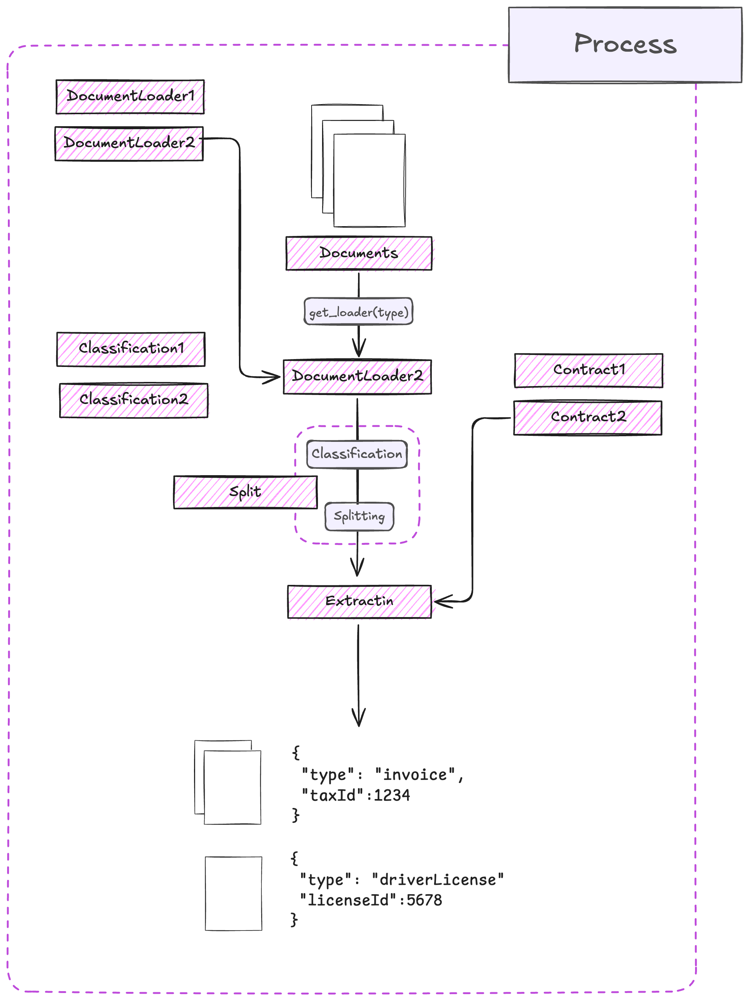

# Extract Thinker

### The first Framework for Document Intelligence Processing (IDP) - **for LLMs**

<div align="center">
  
</div>

<div style="display: flex; justify-content: center; gap: 16px; margin: 24px 0;">
    <a href="https://github.com/enoch3712/Open-DocLLM" style="text-decoration: none; background: linear-gradient(45deg, #FFD1DC, #FF69B4); color: white; padding: 12px 24px; border-radius: 4px; display: flex; align-items: center; gap: 8px; transition: opacity 0.2s ease;">
        <span style="font-size: 16px; opacity: 0.9;">★</span>
        <span>Star the Repo</span>
    </a>
    <a href="../examples/basic-examples" style="text-decoration: none; border: 2px solid #FF69B4; color: #FF69B4; padding: 12px 24px; border-radius: 4px; display: flex; align-items: center; gap: 8px; transition: all 0.2s ease;">
<span class="twemoji"><svg xmlns="http://www.w3.org/2000/svg" viewBox="0 0 24 24"><path d="M12 21.5c-1.35-.85-3.8-1.5-5.5-1.5-1.65 0-3.35.3-4.75 1.05-.1.05-.15.05-.25.05-.25 0-.5-.25-.5-.5V6c.6-.45 1.25-.75 2-1 1.11-.35 2.33-.5 3.5-.5 1.95 0 4.05.4 5.5 1.5 1.45-1.1 3.55-1.5 5.5-1.5 1.17 0 2.39.15 3.5.5.75.25 1.4.55 2 1v14.6c0 .25-.25.5-.5.5-.1 0-.15 0-.25-.05-1.4-.75-3.1-1.05-4.75-1.05-1.7 0-4.15.65-5.5 1.5M12 8v11.5c1.35-.85 3.8-1.5 5.5-1.5 1.2 0 2.4.15 3.5.5V7c-1.1-.35-2.3-.5-3.5-.5-1.7 0-4.15.65-5.5 1.5m1 3.5c1.11-.68 2.6-1 4.5-1 .91 0 1.76.09 2.5.28V9.23c-.87-.15-1.71-.23-2.5-.23q-2.655 0-4.5.84zm4.5.17c-1.71 0-3.21.26-4.5.79v1.69c1.11-.65 2.6-.99 4.5-.99 1.04 0 1.88.08 2.5.24v-1.5c-.87-.16-1.71-.23-2.5-.23m2.5 2.9c-.87-.16-1.71-.24-2.5-.24-1.83 0-3.33.27-4.5.8v1.69c1.11-.66 2.6-.99 4.5-.99 1.04 0 1.88.08 2.5.24z"></path></svg></span>
        <span>Examples</span>
    </a>
    
    <a href="../examples/production-workflows" style="text-decoration: none; border: 2px solid #FF69B4; color: #FF69B4; padding: 12px 24px; border-radius: 4px; display: flex; align-items: center; gap: 8px; transition: all 0.2s ease;">
		<span class="twemoji"><svg xmlns="http://www.w3.org/2000/svg" viewBox="0 0 24 24"><path d="M6 5.75 10.25 10H7v6h6.5l2 2H7a2 2 0 0 1-2-2v-6H1.75zm12 12.5L13.75 14H17V8h-6.5l-2-2H17a2 2 0 0 1 2 2v6h3.25z"></path></svg></span>
        <span>Production Workflows</span>
    </a>
</div>

Is a flexible document intelligence framework that helps you extract and classify structured data from various documents, acting like an **ORM** for document processing workflows. One phrase you say is **“Document Intelligence for LLMs”** or **“LangChain for Intelligent Document Processing.”** The motivation is to create niche features required for document processing, like splitting large documents and advanced classification.

---

## Installation

Install using pip:

```bash
pip install extract_thinker
```

## Quick Start

Here's a simple example that extracts invoice data from a PDF:

```python
from extract_thinker import Extractor, DocumentLoaderPyPdf, Contract

# Define what data you want to extract
class InvoiceContract(Contract):
    invoice_number: str
    invoice_date: str
    total_amount: float

# Initialize the extractor
extractor = Extractor()
extractor.load_document_loader(DocumentLoaderPyPdf())
extractor.load_llm("gpt-4")  # or any other supported model

# Extract data from your document
result = extractor.extract("invoice.pdf", InvoiceContract)

print(f"Invoice #{result.invoice_number}")
print(f"Date: {result.invoice_date}")
print(f"Total: ${result.total_amount}")
```

## Native Features that you want

<div class="grid cards">
    <ul>
        <li>
            <p><span class="twemoji"><svg xmlns="http://www.w3.org/2000/svg" viewBox="0 0 24 24"><path d="M14 2H6c-1.1 0-2 .9-2 2v16c0 1.1.9 2 2 2h12c1.1 0 2-.9 2-2V8l-6-6zM6 20V4h7v5h5v11H6z"></path></svg></span> <strong>Extraction with Pydantic</strong></p>
            <p>Extract structured data from any document type using Pydantic models for validation, custom features, and prompt engineering capabilities.</p>
            <p><a href="../examples/extraction"><span class="twemoji"><svg xmlns="http://www.w3.org/2000/svg" viewBox="0 0 16 16"><path d="M8.22 2.97a.75.75 0 0 1 1.06 0l4.25 4.25a.75.75 0 0 1 0 1.06l-4.25 4.25a.75.75 0 0 1-1.042-.018.75.75 0 0 1-.018-1.042l2.97-2.97H3.75a.75.75 0 0 1 0-1.5h7.44L8.22 4.03a.75.75 0 0 1 0-1.06"></path></svg></span> Learn More</a></p>
        </li>
        <li>
            <p><span class="twemoji"><svg xmlns="http://www.w3.org/2000/svg" viewBox="0 0 24 24"><path d="M12 2L4.5 20.29l.71.71L12 18l6.79 3 .71-.71z"></path></svg></span> <strong>Classification & Split</strong></p>
            <p>Intelligent document classification and splitting with support for consensus strategies, eager/lazy splitting, and confidence thresholds.</p>
            <p><a href="../examples/classification"><span class="twemoji"><svg xmlns="http://www.w3.org/2000/svg" viewBox="0 0 16 16"><path d="M8.22 2.97a.75.75 0 0 1 1.06 0l4.25 4.25a.75.75 0 0 1 0 1.06l-4.25 4.25a.75.75 0 0 1-1.042-.018.75.75 0 0 1-.018-1.042l2.97-2.97H3.75a.75.75 0 0 1 0-1.5h7.44L8.22 4.03a.75.75 0 0 1 0-1.06"></path></svg></span> Learn More</a></p>
        </li>
        <li>
            <p><span class="twemoji"><svg xmlns="http://www.w3.org/2000/svg" viewBox="0 0 24 24"><path d="M12 1 3 5v6c0 5.55 3.84 10.74 9 12 5.16-1.26 9-6.45 9-12V5l-9-4zm0 10.99h7c-.53 4.12-3.28 7.79-7 8.94V12H5V6.3l7-3.11v8.8z"></path></svg></span> <strong>PII Detection</strong></p>
            <p>Automatically detect and handle sensitive personal information in documents with privacy-first approach and advanced validation.</p>
            <p><a href="../examples/pii"><span class="twemoji"><svg xmlns="http://www.w3.org/2000/svg" viewBox="0 0 16 16"><path d="M8.22 2.97a.75.75 0 0 1 1.06 0l4.25 4.25a.75.75 0 0 1 0 1.06l-4.25 4.25a.75.75 0 0 1-1.042-.018.75.75 0 0 1-.018-1.042l2.97-2.97H3.75a.75.75 0 0 1 0-1.5h7.44L8.22 4.03a.75.75 0 0 1 0-1.06"></path></svg></span> Learn More</a></p>
        </li>
        <li>
            <p><span class="twemoji"><svg xmlns="http://www.w3.org/2000/svg" viewBox="0 0 24 24"><path d="M21.7 18.6-6.9-6.9q-.275-.275-.637-.425-.363-.15-.763-.15-.425 0-.787.15-.363.15-.638.425L8.1 15.5q-.275.275-.425.638-.15.362-.15.762 0 .425.15.788.15.362.425.637l6.9 6.9q.275.275.638.425.362.15.787.15.425 0 .788-.15.362-.15.637-.425l4.9-4.9q.275-.275.425-.637.15-.363.15-.788 0-.425-.15-.787-.15-.363-.425-.638Z"></path></svg></span> <strong>LLM and OCR Agnostic</strong></p>
            <p>Freedom to choose and switch between different LLM providers and OCR engines based on your needs and cost requirements.</p>
            <p><a href="../examples/integrations"><span class="twemoji"><svg xmlns="http://www.w3.org/2000/svg" viewBox="0 0 16 16"><path d="M8.22 2.97a.75.75 0 0 1 1.06 0l4.25 4.25a.75.75 0 0 1 0 1.06l-4.25 4.25a.75.75 0 0 1-1.042-.018.75.75 0 0 1-.018-1.042l2.97-2.97H3.75a.75.75 0 0 1 0-1.5h7.44L8.22 4.03a.75.75 0 0 1 0-1.06"></path></svg></span> Learn More</a></p>
        </li>
    </ul>
</div>

Check out our [advanced usage guide](./advanced-usage.md) for more complex scenarios like document classification, batch processing, and custom LLM integration.
